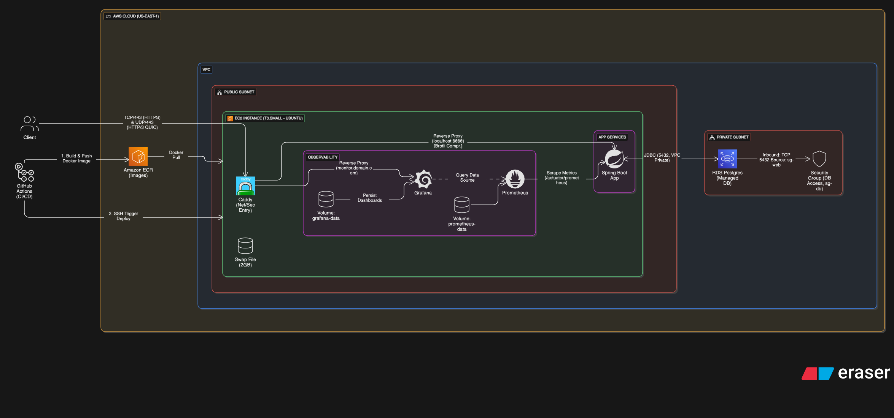

# SplitWise

SplitWise is a web application designed to help users manage and split expenses among friends and groups. It provides an easy-to-use interface for tracking shared costs, settling debts, and maintaining transparency in financial transactions.

## Features

- User Registration and Authentication (Jwt)
- Expense Tracking
- Group Management
- Debt Settlement
- Notifications and Reminders
- Reporting and Analytics

## Technologies Used

- Backend: Spring Boot, Java
- Database: PostgreSQL

## 🚦 Getting Started



### Prerequisites

- **JDK 21 or higher**
- **Docker & Docker Compose** (for containerized setup)
- **PostgreSQL 17** (for local non-Docker setup)
- **Maven 3.6+**

### Quick Start with GitHub Codespaces

[](https://codespaces.new/Sanjeev-Kumar78/splitwise-v2)

### Local Development Setup

#### 1. Clone the Repository

```bash
git clone https://github.com/Sanjeev-Kumar78/splitwise-v2.git
cd splitwise-v2
```

#### 2. Configure Environment Variables

Create a `.env` file in the project root with the following variables:

```bash
# Database Configuration
DB_NAME=Splitwisev2
DB_USERNAME=postgres
DB_PASSWORD=your_postgres_password
DB_URL=jdbc:postgresql://localhost:5432/Splitwisev2

# Frontend URL (CORS)
FRONTEND_URL=http://localhost:3000

# Grafana Configuration
GRAFANA_USERNAME=admin
GRAFANA_PASSWORD=admin
GRAFANA_ROOT_URL=http://localhost/grafana/

# Domain (for Caddy reverse proxy)
DOMAIN=:80
```

#### 3. Option A: Using Docker Compose (Recommended)

```bash
# Start all services (backend, Prometheus, Grafana, Caddy)
docker compose up --build

# Stop services
docker compose down

# View logs
docker compose logs -f backend
```

**Access Points:**

- Backend API: `http://localhost/api`
- Swagger UI: `http://localhost/swagger-ui/index.html`
- Grafana: `http://localhost/grafana` (admin/admin)
- GRAFANA DASHBOARDS: ID 19004 (Spring Boot 3.x)
- Prometheus: `http://localhost/prometheus`

#### 4. Option B: Using JDK and Local PostgreSQL

**Start PostgreSQL:**

```bash
# Create database
createdb Splitwisev2

# Or using psql
psql -U postgres
CREATE DATABASE Splitwisev2;
\q
```

**Run the application:**

```bash
# Build the project
mvn clean install

# Run Spring Boot application
mvn spring-boot:run
```

**Access the application:**

- API: `http://localhost:8080`
- Health Check: `http://localhost:8080/api/users/ping`
- Swagger UI: `http://localhost:8080/swagger-ui/index.html`

## 🌐 Production Deployment

### Automated CI/CD Pipeline

The application uses GitHub Actions for continuous deployment to AWS:

**Deployment Flow:**

1. **Push to `main` branch** triggers the workflow
2. **Build & Push:** Docker image built and pushed to AWS ECR
3. **Deploy:** EC2 instance pulls latest image via SSM
4. **Update:** Repository URL automatically updated with live URL

### AWS Infrastructure

- **Compute:** EC2 instance (t4g.micro recommended)
- **Database:** RDS PostgreSQL 17
- **Container Registry:** Amazon ECR
- **Secrets Management:** AWS Systems Manager (SSM)
- **Authentication:** OIDC (GitHub → AWS)

### Required GitHub Secrets

Configure these in your repository settings (`Settings → Secrets and variables → Actions`):

```yaml
AWS_ROLE_ARN          # IAM role ARN for OIDC authentication
AWS_ACCOUNT_ID        # Your AWS account ID
EC2_INSTANCE_ID       # Target EC2 instance ID
EC2_WORKDIR           # Deployment directory on EC2 (e.g., /home/ec2-user/app)
EC2_SECRET_DIR        # Directory containing .env and scripts
```

### Required GitHub Variables

```yaml
AWS_REGION            # AWS region (e.g., us-east-2)
ECR_REPO              # ECR repository name (e.g., splitwisev2)
IMAGE_TAG             # Docker image tag (e.g., latest)
```

### EC2 Setup Requirements

1. **Install Docker & Docker Compose**
2. **Configure SSM Agent** (pre-installed on Amazon Linux 2)
3. **IAM Role** with permissions:
   - ECR pull access
   - SSM access
4. **Security Group** allowing inbound traffic on ports 80 and 443
5. **Environment files** in `$EC2_SECRET_DIR`:
   - `.env` with production credentials
   - `script_runner.sh` deployment script

### Manual Deployment

If you need to deploy manually:

```bash
# SSH into EC2 instance
ssh ec2-user@<your-ec2-ip>

# Navigate to app directory
cd /home/ec2-user/app

# Pull latest changes
git pull origin main

# Copy environment files
cp /path/to/secrets/.env .

# Deploy with Docker Compose
docker compose pull
docker compose up -d

# View logs
docker compose logs -f
```

## 📊 Monitoring

### Grafana Dashboards

Access Grafana at `https://<your-domain>/grafana`

**Available Dashboards:**

- Spring Boot Application Metrics
- JVM Performance
- Database Connections
- HTTP Request/Response metrics
- Custom business metrics

### Prometheus Metrics

Access Prometheus at `https://<your-domain>/prometheus`

**Key Metrics:**

- `http_server_requests_seconds` - API response times
- `jvm_memory_used_bytes` - Memory usage
- `jdbc_connections_active` - Database connections
- Custom application metrics

### Health Checks

- **Application Health:** `GET /actuator/health`
- **Readiness:** `GET /actuator/health/readiness`
- **Liveness:** `GET /actuator/health/liveness`

## 📖 API Documentation

Comprehensive API documentation is available via Swagger UI:

- **Local:** `http://localhost:8080/swagger-ui/index.html`
- **Production:** `https://<your-domain>/swagger-ui/index.html`

### API Routes Overview

#### Authentication (Public)

- `POST /api/auth/signup` - User registration
- `POST /api/auth/login` - User login

#### Users (Protected)

- `POST /api/users` - Create user
- `GET /api/users/ping` - Health check (Public)
- `GET /api/users` - List all users
- `GET /api/users/{id}` - Get user by ID
- `GET /api/users/me` - Get authenticated user profile
- `GET /api/users/search?username=<username>` - Search user by username
- `PUT /api/users/{id}` - Update user
- `DELETE /api/users/{id}` - Delete user
- `POST /api/users/set-username` - Set username for current user
- `POST /api/users/set-password` - Change password for current user

#### Events (Protected)

- `POST /api/events` - Create event
- `GET /api/events` - List all events
- `GET /api/events/{id}` - Get event by ID
- `PUT /api/events/{id}` - Update event
- `DELETE /api/events/{id}` - Delete event
- `POST /api/events/{id}/cancel` - Cancel event (soft delete)
- `GET /api/events/{eventId}/debitors` - Get event participants/splits

#### Debitors (Protected)

- `POST /api/events/{eventId}/debitors` - Add debitor to event
- `POST /api/debitors/{eventId}` - Add debitor (alternate path)
- `DELETE /api/debitors/{debitorId}` - Remove debitor from event

#### Payments (Protected)

- `POST /api/payments/pay` - Make payment towards a split

### CSRF Protection

The API uses cookie-based CSRF protection for state-changing operations:

1. **Frontend Setup:** Read `XSRF-TOKEN` cookie and send as `X-XSRF-TOKEN` header
2. **Excluded Endpoints:** `/api/auth/**`, `/h2-console/**`, `/actuator/**`, Swagger UI
3. **Protected Methods:** POST, PUT, DELETE, PATCH

**Example (Axios):**

```javascript
// Axios automatically handles XSRF tokens
axios.defaults.withCredentials = true;
```

**Example (Fetch API):**

```javascript
const csrfToken = document.cookie
  .split("; ")
  .find((row) => row.startsWith("XSRF-TOKEN="))
  ?.split("=")[1];

fetch("/api/events", {
  method: "POST",
  headers: {
    "Content-Type": "application/json",
    "X-XSRF-TOKEN": csrfToken,
    Authorization: `Bearer ${jwtToken}`,
  },
  credentials: "include",
  body: JSON.stringify(eventData),
});
```

## 🔐 Security

- **Authentication:** JWT tokens with configurable expiration
- **CSRF Protection:** Cookie-based tokens for SPA compatibility
- **CORS:** Configurable allowed origins via environment variables
- **Password Encryption:** BCrypt hashing
- **Session Management:** Stateless (no server-side sessions)
- **HTTPS:** Automatic via Caddy reverse proxy in production

## 📝 License

This project is licensed under the MIT License.

## 👤 Authors

**Atul Kumar Rana**

- Codebase_Written By: [@Atul-Kumar-Rana](https://github.com/Atul-Kumar-Rana)

**Sanjeev Kumar**

- CI/CD Pipeline By [@Sanjeev-Kumar78](https://github.com/Sanjeev-Kumar78)
